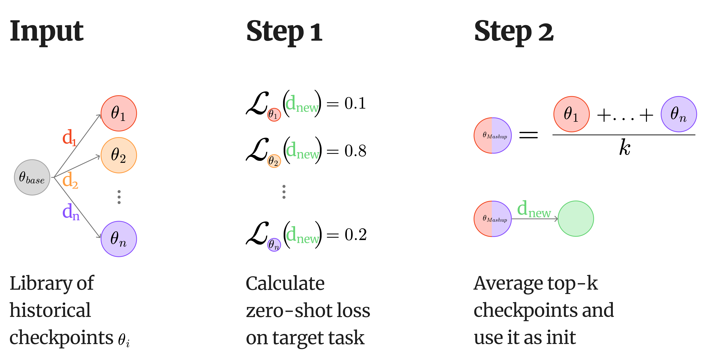

# Mashup Learning: Faster Finetuning by Remixing Past Checkpoints

Official code for **Mashup Learning**, a method that leverages historical finetuned checkpoints to produce better initializations for new tasks.

**Core idea:** Checkpoints finetuned on related tasks contain useful task-general representations that transfer well. By selecting the most relevant checkpoints from a library, merging them, and using the result as a starting point for training, Mashup Learning achieves up to 8% higher accuracy across 8 standard LLM benchmarks while maintaining the same compute budget, and **reaches the same quality as training from scratch with up to 47.5% fewer iterations**.



## Main Results

| Model | Setup | From Scratch | Mashup Learning | Δ | Training to Parity (%) |
|-------|-------|:---:|:---:|:---:|:---:|
| Gemma-3 1B | LoRA | 70.0 | **71.8** | +1.8 | 68.0 |
| Gemma-3 1B | Full FT | 68.3 | **70.2** | +1.9 | 57.2 |
| Gemma-2 2B | LoRA | 80.8 | **81.5** | +0.7 | 72.6 |
| Gemma-2 2B | Full FT | 77.5 | **78.0** | +0.5 | 63.1 |
| Gemma-3 4B | LoRA | 83.2 | **84.2** | +1.0 | 70.4 |
| Gemma-3 4B | Full FT | 80.2 | **80.9** | +0.7 | 66.9 |

Average accuracy (%) across 8 benchmarks. **Training to Parity** = percentage of training at which Mashup Learning matched converged from-scratch accuracy (lower is better). Mashup Learning consistently outperforms training from scratch across all models and setups. Full per-task breakdowns, wall-clock timing tables, and additional analysis are in the paper and can be regenerated with `mashup-analyze` (see [Produce Plots and Tables](#produce-plots-and-tables)).

## Quick Start

Run a minimal Mashup Learning experiment (3 tasks, 2 learning rates) to see the full pipeline in action:

```bash
# 1. One-command setup (install deps, patch axolotl, create .env, preprocess data)
bash setup.sh

# 2. Run the quickstart pipeline (LoRA)
uv run python scripts/pipeline.py configs/pipeline/test_lora.yaml --seed 42
```

Results, training curves, and LaTeX tables will appear in the run's `analysis/` folder. The quickstart configs use ARC-Easy, CommonsenseQA, and OpenBookQA with 2 learning rates -- enough to demonstrate the full flow (train, select, merge, retrain, evaluate) in a fraction of the time.

## Setup

**Requirements:** Python >=3.13, [uv](https://docs.astral.sh/uv/getting-started/installation/), CUDA-capable GPUs. All experiments in the paper were conducted on 8× H100 GPUs (up to 40 GB RAM per process). Fewer or smaller GPUs will work — adjust `per_device_train_batch_size` and `gradient_accumulation_steps` in the training configs to fit your memory budget.

The fastest way to set up is the one-command script:

```bash
bash setup.sh
```

Or manually, step by step:

```bash
# 1. Install dependencies
uv sync

# 2. Install axolotl with flash-attn and deepspeed
uv pip install --no-build-isolation "axolotl[flash-attn,deepspeed]"

# 3. Patch axolotl for transformers 5.x compatibility (see Known Issues)
uv run python scripts/postinstall.py

# 4. Set up credentials (WandB + HuggingFace token for gated models)
cp .env.example .env
# Edit .env with your WANDB_API_KEY and HF_TOKEN
# HF_TOKEN is required for gated models (e.g., Gemma)
```

## Dataset Preparation

All 8 benchmarks must be preprocessed before training. The script downloads from HuggingFace, applies chat-template transforms, and saves to `data/processed/`.

```bash
uv run python scripts/preprocess_datasets.py --all
```

| Dataset | Short Name | Train Size | Val Size |
|---------|------------|------------|----------|
| ARC-Easy | ARC-e | 2,251 | 570 |
| CommonsenseQA | CSQA | 9,741 | 1,221 |
| HellaSwag | Hella. | 39,905 | 10,042 |
| MathQA | MathQA | 29,837 | 4,475 |
| OpenBookQA | OBQA | 4,957 | 500 |
| PIQA | PIQA | 16,113 | 1,838 |
| SocialIQA | SIQA | 33,410 | 1,954 |
| WinoGrande | Wino. | 40,398 | 1,267 |

## Reproducing Paper Results

All primary experiments use a **leave-one-out** protocol: for each of the 8 tasks, the remaining 7 serve as the checkpoint library. The pipeline handles training from scratch, relevance estimation, checkpoint merging, training from merged initialization, LR sweeps, and evaluation end-to-end.

### Tables with Main Results, Convergence Speedup, Wall-Clock Time

Run all 18 experiments (3 models × 3 seeds × 2 methods) with automatic skip-if-complete, resume, and retry:

```bash
bash scripts/run_all_experiments.sh
```

Or run only LoRA / only Full FT:

```bash
bash scripts/run_all_experiments.sh --lora-only
bash scripts/run_all_experiments.sh --fullft-only
```

You can also run individual pipelines directly:

```bash
uv run python scripts/pipeline.py configs/pipeline/leave_one_out_lora.yaml \
    --base-model google/gemma-3-1b-it --experiment-name gemma3_1b --seed 42
```

Per-model plots will appear in the analysis folder within the corresponding run folder: results table, LR sweep table, convergence speedup, wall-clock timing, training curves, LR sensitivity plots.

## Pipeline Overview

A pipeline config defines an experiment as a sequence of **stages** that execute in order. Within each stage, jobs run in parallel across available GPUs.

1. The pipeline detects available GPUs via `nvidia-smi`
2. Stages run sequentially — each must complete before the next starts
3. Jobs within a stage run in parallel, each assigned to a free GPU
4. A timestamped run directory under `outputs/` stores all artifacts, resolved configs, and logs
5. If any job in a stage fails, the pipeline stops and points you to the log files

### Pipeline Output

Each run produces a timestamped directory under `outputs/`:

```
outputs/gemma3_1b_seed42_20260210_120000/
├── pipeline.yaml                           # Snapshot of the pipeline config
├── logs/                                   # stdout/stderr per job
├── lora_<task>_lr<lr>/                     # Training output (adapter weights)
├── eval_lora_<task>_lr<lr>/                # Evaluation results
├── merged_lora_<task>/                     # Merged initialization
├── trained_merged_<task>_lr<lr>/           # Model trained from merged init
├── summary/                                # Final collected results
└── analysis/                               # LaTeX tables & plots (auto-generated)
```

## Produce Plots and Tables

The `mashup-analyze` CLI generates publication-quality LaTeX tables and matplotlib plots from pipeline results. Tasks, learning rates, and seeds are auto-discovered from the data.

```bash
# Install analysis deps (matplotlib, seaborn)
uv sync --extra analysis
```

### Per-model analysis (multi-seed)

Aggregate results across multiple seed runs for one model:

```bash
uv run python scripts/analyze.py model "outputs/gemma3_1b_seed*" -o latex/gemma3_1b/

# All LoRA models
for model in gemma3_1b gemma2_2b gemma3_4b; do
  uv run python scripts/analyze.py model "outputs/${model}_seed*" -o latex/${model}/
done

# All Full FT models
for model in gemma3_1b_fullft gemma2_2b_fullft gemma3_4b_fullft; do
  uv run python scripts/analyze.py model "outputs/${model}_seed*" -o latex/${model}/
done
```

Per-model outputs: results table, LR sweep table, convergence speedup, wall-clock timing, training curves (2×N grid), LR sensitivity plots.

### Combined cross-model tables

Generate tables comparing all models in a group:

```bash
# By group
uv run python scripts/analyze.py combined lora -o latex/combined_lora/
uv run python scripts/analyze.py combined fullft -o latex/combined_fullft/

# All models together
uv run python scripts/analyze.py combined all -o latex/combined/
```

Combined outputs: results table, timing table, speedup table (normal + strict) across models in the group.

## Project Structure

```
mashup/
├── configs/
│   ├── pipeline/          # Experiment pipeline definitions
│   ├── train/             # Reusable training configs (LoRA, Full FT, WandB)
│   ├── tasks/             # Per-dataset configs (8 benchmarks)
│   ├── eval/              # Evaluation presets
│   └── merge/             # Merge method presets (linear, TIES, DARE-TIES)
├── scripts/               # CLI entry points (thin wrappers)
│   ├── pipeline.py        # Pipeline orchestrator CLI
│   ├── analyze.py         # Analysis CLI (tables & plots)
│   ├── train.py           # Axolotl training wrapper
│   ├── merge.py           # MergeKit merging wrapper
│   ├── lora_merge.py      # LoRA adapter averaging
│   ├── eval.py            # Model evaluation
│   ├── topk.py            # Top-k model selection
│   ├── select_best.py     # Best checkpoint/LR selection
│   ├── summary.py         # Results collection
│   ├── cleanup.py         # Directory cleanup
│   ├── wait_for_disk.py   # Disk space poller
│   └── preprocess_datasets.py  # Dataset preprocessing
├── src/mashup/            # Core library
│   ├── pipeline.py        # Async GPU scheduling & orchestration
│   ├── analysis/          # LaTeX table & plot generation
│   │   ├── config.py      # AnalysisConfig from pipeline YAML
│   │   ├── discovery.py   # Auto-discover tasks, LRs, seeds
│   │   ├── tables.py      # Results & LR sweep tables
│   │   ├── speedup.py     # Convergence speedup tables
│   │   ├── timing.py      # Wall-clock timing tables
│   │   ├── plots.py       # Training curves & LR sensitivity plots
│   │   ├── combined.py    # Cross-model combined tables
│   │   └── tex_utils.py   # Shared LaTeX utilities
│   ├── evaluation.py      # Token-level accuracy, exact match, perplexity
│   ├── merging.py         # MergeKit integration (linear, TIES, DARE-TIES)
│   ├── lora_merge.py      # LoRA adapter averaging
│   ├── preprocessing.py   # Dataset registry & preprocessing logic
│   ├── dataset_transforms.py  # Chat-template transform functions
│   ├── topk.py            # Top-k model selection
│   ├── select_best.py     # Best checkpoint/LR selection
│   ├── summary.py         # Results table builder
│   ├── cleanup.py         # Glob-based directory cleanup
│   └── wait_for_disk.py   # Disk space polling
├── latex/                 # Generated paper tables and figures
├── data/processed/        # Preprocessed datasets (gitignored)
├── outputs/               # Experiment outputs (gitignored)
├── .env.example           # Credentials template
└── pyproject.toml         # Dependencies and tooling config
```

All scripts are also available as console commands after `uv sync`: `mashup-pipeline`, `mashup-train`, `mashup-eval`, `mashup-merge`, `mashup-lora-merge`, `mashup-topk`, `mashup-select-best`, `mashup-summary`, `mashup-cleanup`, `mashup-preprocess`, `mashup-analyze`.

## Known Issues

**Axolotl / trl / transformers 5.x incompatibility:** Axolotl 0.9.1 and trl were built for transformers 4.x. Transformers 5.x introduced several breaking changes (renamed classes, removed kwargs, changed return types). The `scripts/postinstall.py` script automatically patches the installed packages to fix all known incompatibilities. This is run as part of `bash setup.sh`, or you can run it manually with `uv run python scripts/postinstall.py`. The script is idempotent and safe to run multiple times.
